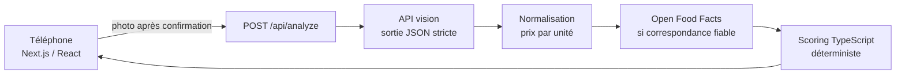

# monRayon

> Trop de choix dans le rayon ? Une photo, trois choix.

monRayon est un MVP mobile pour choisir parmi les produits alimentaires emballés visibles dans un rayon de supermarché français. L’utilisateur photographie quelques produits avec leurs étiquettes de prix ; l’application répond avec trois recommandations maximum : **meilleur prix**, **meilleur compromis qualité/prix** et **meilleure composition**.

Le premier périmètre couvre les céréales de petit-déjeuner et une photo rapprochée de 3 à 8 références.

<p align="center">
  
</p>

## Ce qui fonctionne

- prise de photo avec la caméra arrière ou import depuis la photothèque ;
- aperçu et reprise de la photo ;
- extraction structurée des produits, prix, quantités et positions par un modèle vision ;
- calcul du prix au kg en TypeScript ;
- enrichissement par Open Food Facts quand la correspondance est assez fiable ;
- scoring déterministe et explicable ;
- trois recommandations maximum, avec gestion des données inconnues ;
- cadres sur les produits sélectionnés dans la photo ;
- mode démonstration entièrement local, sans clé API et clairement identifié ;
- logs serveur simples et erreurs compréhensibles ;
- tests unitaires du scoring et du prix unitaire.

Les quatre marques du mode démo sont fictives. Les résultats réels ne contiennent que les produits détectés dans la photo envoyée.

## Architecture



Un seul projet Next.js contient l’interface et la route serveur. Il n’y a ni base de données, ni compte, ni microservice. La clé OpenAI reste côté serveur. La photo n’est envoyée qu’après un appui sur « Analyser cette photo ».

Le modèle vision observe l’image et remplit un schéma JSON. Il ne décide jamais du classement final. Le code recalcule notamment le prix au kg à partir du prix du paquet et de la quantité dès que ces deux valeurs sont disponibles.

## Installation

Prérequis : Node.js 20 ou plus récent.

```bash
git clone <url-du-repo>
cd monRayon
npm install
cp .env.example .env.local
```

Pour activer l’analyse réelle, renseigner la clé côté serveur :

```dotenv
OPENAI_API_KEY=...
OPENAI_VISION_MODEL=gpt-4.1-mini
```

Le modèle par défaut accepte les images et les sorties structurées. Il peut être remplacé via la variable d’environnement sans modifier le code. Le [mode démonstration](public/demo-shelf.svg) fonctionne sans aucune clé.

## Lancement

```bash
npm run dev
```

Ouvrir `http://localhost:3000`. Pour tester depuis un téléphone connecté au même réseau :

```bash
npm run dev -- --hostname 0.0.0.0
```

Puis ouvrir l’adresse IP locale de l’ordinateur sur le port 3000. Un déploiement HTTPS donne le comportement le plus fiable pour la capture caméra sur les navigateurs mobiles.

Commandes de validation :

```bash
npm test
npm run lint
npm run build
```

## Données produites

Chaque produit détecté conserve les observations et leurs niveaux de confiance :

```json
{
  "product_name": "Muesli Fruits",
  "brand": "Monts & Graines",
  "price": 2.8,
  "quantity": "700 g",
  "quantity_amount": 700,
  "quantity_unit": "g",
  "price_per_unit": 4,
  "price_unit": "kg",
  "barcode": null,
  "bounding_box": { "x": 0.28, "y": 0.2, "width": 0.18, "height": 0.44 },
  "confidence": 0.98,
  "identity_confidence": 0.98,
  "price_confidence": 0.99,
  "price_product_match_confidence": 0.98
}
```

Une donnée absente vaut `null`. Elle n’est jamais remplacée par une valeur supposée. Les prix dont la lecture ou l’association au produit est trop incertaine sont exclus des scores économiques.

## Scoring

Tous les scores vont de 0 à 100. Les constantes sont regroupées dans [`src/lib/scoring.ts`](src/lib/scoring.ts).

### Prix

Pour les céréales, les produits sont comparés en euros par kilogramme :

```text
score_prix = 100 × prix_kg_minimum / prix_kg_produit
```

Le produit le moins cher obtient 100. Un produit deux fois plus cher obtient 50.

### Composition

```text
Nutri-Score : A=100, B=75, C=50, D=25, E=0
score_sucres = 100 × max(0, 1 − sucres_pour_100g / 30)
score_composition = 70 % Nutri-Score + 30 % score_sucres
```

Le repère de 30 g sert uniquement à rendre le classement du prototype lisible ; ce n’est pas un seuil médical. Les additifs et NOVA sont affichés quand ils existent, mais ne modifient pas ce premier score.

Si une composante manque, le score est recalculé avec les composantes connues puis légèrement pénalisé :

```text
score = somme(poids × score connu) / somme(poids connus)
        − 10 × poids manquant
```

Une couverture d’au moins 70 % est nécessaire pour gagner les catégories composition ou compromis. Avec les seuls sucres, un produit n’est donc pas éligible.

### Qualité/prix

```text
score_qualité_prix = 50 % score_prix + 50 % score_composition
```

Les égalités sont départagées par la couverture des données, puis par le prix au kilo et enfin par un identifiant stable. Si un même produit gagne plusieurs catégories, une seule carte porte plusieurs badges.

## Open Food Facts

Une recherche exacte par code-barres est privilégiée. Lorsque le code n’est pas visible, l’application recherche par nom, marque et quantité, puis calcule une confiance de correspondance avant tout enrichissement. Une correspondance faible est ignorée.

Les appels sont mis en cache en mémoire et limités au petit nombre de références de la photo. L’API v3 est utilisée pour les codes-barres ; la recherche textuelle utilise l’endpoint historique car la recherche plein texte n’est pas encore disponible dans l’API v3. Voir la [documentation Open Food Facts](https://openfoodfacts.github.io/documentation/docs/Product-Opener/api/).

Open Food Facts est une base collaborative : ses informations peuvent être absentes ou incorrectes. Ses données sont réutilisées selon l’[Open Database License](https://opendatacommons.org/licenses/odbl/).

## Limites du MVP

- Une photo de rayon complet contient souvent des textes trop petits. Le MVP demande un cadrage de 3 à 8 produits.
- La relation prix-produit reste le point le plus fragile : une étiquette décalée ou une promotion par lot peut créer une ambiguïté.
- Un code-barres est rarement visible de face. La correspondance Open Food Facts par nom, marque et quantité est moins sûre qu’une lecture du code.
- Le modèle vision peut varier ou se tromper malgré la sortie structurée. Le classement est déterministe à observations identiques, pas l’extraction de l’image.
- Les données nutritionnelles manquantes réduisent les catégories disponibles au lieu d’être inventées.
- Le mode réel nécessite une clé et entraîne un coût variable par image selon le modèle choisi. Open Food Facts ne facture pas l’accès, mais impose des limites de requêtes.
- L’analyse réelle par l’API vision n’est pas couverte par les tests automatiques : les tests utilisent une réponse simulée et le mode démo.

## Structure du projet

```text
src/
  app/api/analyze/route.ts   route serveur et erreurs HTTP
  components/photo-flow.tsx parcours mobile complet
  lib/vision.ts              extraction JSON depuis l’image
  lib/open-food-facts.ts     recherche et correspondance produit
  lib/units.ts               calcul du prix par unité
  lib/scoring.ts             scores et sélection des gagnants
  lib/pipeline.ts            orchestration du traitement
tests/                       scoring, prix unitaire et contrat vision
```

## Roadmap

1. Constituer un petit jeu de photos réelles de céréales et mesurer précision, rappel et association prix-produit.
2. Ajouter un écran de correction rapide lorsqu’une association est incertaine.
3. Recadrer automatiquement les étiquettes de prix avant une seconde lecture OCR.
4. Évaluer d’autres rayons emballés seulement après validation du périmètre céréales.
5. Ajouter une PWA installable et un budget d’usage par déploiement.

## Sources techniques

- [Entrées image et limites des modèles vision](https://developers.openai.com/api/docs/guides/images-vision)
- [Responses API](https://developers.openai.com/api/reference/resources/responses/methods/create)
- [Route Handlers Next.js](https://nextjs.org/docs/app/getting-started/route-handlers)
- [Documentation API Open Food Facts](https://openfoodfacts.github.io/documentation/docs/Product-Opener/api/)
