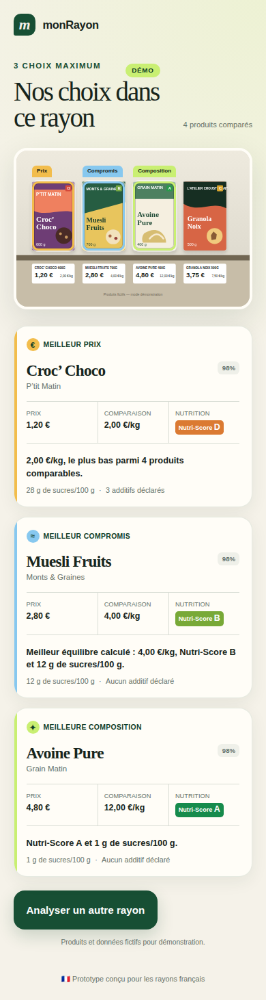
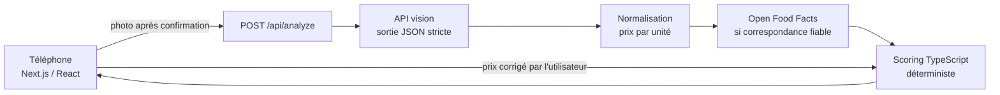

# monRayon

> Trop de choix dans le rayon ? Une photo, trois choix.

monRayon est un MVP mobile pour choisir parmi les produits alimentaires emballés visibles dans un rayon de supermarché français. L’utilisateur photographie quelques produits avec leurs étiquettes de prix ; l’application répond avec trois recommandations maximum : **meilleur prix**, **meilleur compromis qualité/prix** et **meilleure composition**.

Le premier périmètre couvre les céréales de petit-déjeuner et une photo rapprochée de 3 à 8 références.

<p align="center">
  
</p>

## Ce qui fonctionne

- prise de photo avec la caméra arrière ou import depuis la photothèque ;
- aperçu et reprise de la photo ;
- extraction structurée des produits, prix, quantités et positions par un modèle vision ;
- calcul du prix au kg en TypeScript ;
- enrichissement par Open Food Facts quand la correspondance est assez fiable ;
- scoring déterministe et explicable ;
- trois recommandations maximum, avec gestion des données inconnues ;
- cadres sur les produits sélectionnés dans la photo ;
- correction manuelle des prix mal lus, avec reclassement immédiat et sans renvoi de la photo ;
- limitation de débit par client et plafond d'analyses facturées par déploiement ;
- mode démonstration entièrement local, sans clé API et clairement identifié ;
- logs serveur simples et erreurs compréhensibles ;
- 81 tests unitaires : scoring, prix unitaire, contrat vision, correspondance Open Food Facts, correction des prix, limitation de débit, contrat HTTP de la route et rendu des écrans concernés.

Les quatre marques du mode démo sont fictives. Les résultats réels ne contiennent que les produits détectés dans la photo envoyée.

## Architecture



Un seul projet Next.js contient l’interface et la route serveur. Il n’y a ni base de données, ni compte, ni microservice. La clé OpenAI reste côté serveur. La photo n’est envoyée qu’après un appui sur « Analyser cette photo ».

Le modèle vision observe l’image et remplit un schéma JSON. Il ne décide jamais du classement final. Le code recalcule notamment le prix au kg à partir du prix du paquet et de la quantité dès que ces deux valeurs sont disponibles.

Chaque produit voyage avec sa propre composition Open Food Facts, jamais dans deux tableaux appariés par position : un produit écarté en cours de route ne peut pas décaler les compositions des autres.

## Installation

Prérequis : Node.js 20 ou plus récent.

```bash
git clone <url-du-repo>
cd monRayon
npm install
cp .env.example .env.local
```

Pour activer l’analyse réelle, renseigner la clé côté serveur :

```dotenv
OPENAI_API_KEY=...
OPENAI_VISION_MODEL=gpt-4.1-mini
```

Le modèle par défaut accepte les images et les sorties structurées. Il peut être remplacé via la variable d’environnement sans modifier le code. Le [mode démonstration](public/demo-shelf.svg) fonctionne sans aucune clé.

Trois variables facultatives règlent les garde-fous, avec des valeurs par défaut utilisables telles quelles :

```dotenv
RATE_LIMIT_MAX=10
RATE_LIMIT_WINDOW_SECONDS=300
DAILY_ANALYSIS_BUDGET=200
```

Une valeur absente ou inexploitable retombe sur la valeur par défaut plutôt que de désactiver la protection.

## Lancement

```bash
npm run dev
```

Ouvrir `http://localhost:3000`. Pour tester depuis un téléphone connecté au même réseau :

```bash
npm run dev -- --hostname 0.0.0.0
```

Puis ouvrir l’adresse IP locale de l’ordinateur sur le port 3000. Un déploiement HTTPS donne le comportement le plus fiable pour la capture caméra sur les navigateurs mobiles.

Commandes de validation :

```bash
npm test
npm run lint
npm run build
```

## Données produites

Chaque produit détecté conserve les observations et leurs niveaux de confiance :

```json
{
  "product_name": "Muesli Fruits",
  "brand": "Monts & Graines",
  "price": 2.8,
  "quantity": "700 g",
  "quantity_amount": 700,
  "quantity_unit": "g",
  "price_per_unit": 4,
  "price_unit": "kg",
  "barcode": null,
  "bounding_box": { "x": 0.28, "y": 0.2, "width": 0.18, "height": 0.44 },
  "confidence": 0.98,
  "identity_confidence": 0.98,
  "price_confidence": 0.99,
  "price_product_match_confidence": 0.98
}
```

Une donnée absente vaut `null`. Elle n’est jamais remplacée par une valeur supposée. Les prix dont la lecture ou l’association au produit est trop incertaine sont exclus des scores économiques.

## Scoring

Tous les scores vont de 0 à 100. Les constantes sont regroupées dans [`src/lib/scoring.ts`](src/lib/scoring.ts).

### Prix

Pour les céréales, les produits sont comparés en euros par kilogramme :

```text
score_prix = 100 × prix_kg_minimum / prix_kg_produit
```

Le produit le moins cher obtient 100. Un produit deux fois plus cher obtient 50.

### Composition

```text
Nutri-Score : A=100, B=75, C=50, D=25, E=0
score_sucres = 100 × max(0, 1 − sucres_pour_100g / 30)
score_composition = 70 % Nutri-Score + 30 % score_sucres
```

Le repère de 30 g sert uniquement à rendre le classement du prototype lisible ; ce n’est pas un seuil médical. Les additifs et NOVA sont affichés quand ils existent, mais ne modifient pas ce premier score.

Si une composante manque, le score est recalculé avec les composantes connues puis légèrement pénalisé :

```text
score = somme(poids × score connu) / somme(poids connus)
        − 10 × poids manquant
```

Une couverture d’au moins 70 % est nécessaire pour gagner les catégories composition ou compromis. Avec les seuls sucres, un produit n’est donc pas éligible.

### Qualité/prix

```text
score_qualité_prix = 50 % score_prix + 50 % score_composition
```

Les égalités sont départagées par la couverture des données, puis par le prix au kilo et enfin par un identifiant stable. Si un même produit gagne plusieurs catégories, une seule carte porte plusieurs badges.

## Limitation de débit et budget

La route `/api/analyze` déclenche un appel vision facturé à chaque photo. Deux garde-fous indépendants l'encadrent, parce qu'ils ne protègent pas de la même chose.

**La limitation par client** refuse plus de `RATE_LIMIT_MAX` requêtes par fenêtre glissante et par adresse. Elle arrête le martèlement trivial. La décision est prise *avant* la lecture du corps de la requête : un envoi de 12 Mo n'est jamais parcouru pour être ensuite refusé. La réponse porte un code 429, un en-tête `Retry-After` et un message qui annonce le délai.

**Le plafond de budget** limite le déploiement entier à `DAILY_ANALYSIS_BUDGET` analyses réelles sur 24 h glissantes. C'est lui qui borne réellement la facture : une limite par adresse ne résiste pas à un afflux distribué. Au-delà, la route répond 503 et renvoie vers la démonstration, qui reste disponible.

Le mode démonstration n'appelle aucune API : il compte pour la limitation de débit, jamais pour le budget. Une analyse qui n'a pas atteint l'API — une clé absente, par exemple — rend son jeton, pour qu'une erreur de configuration n'épuise pas le quota du jour et ne masque pas sa propre cause.

Les journaux ne conservent qu'une empreinte tronquée de l'adresse : une adresse IP est une donnée personnelle et le diagnostic n'a pas besoin de la valeur en clair.

**Ce que ce dispositif ne fait pas.** L'état vit dans la mémoire du processus, conformément au parti pris « ni base de données, ni service tiers ». Sur plusieurs instances, chacune applique la limite de son côté, et le plafond réel devient celui d'une instance multiplié par leur nombre ; un redémarrage remet les compteurs à zéro. Derrière un proxy de confiance, `x-forwarded-for` identifie correctement le client ; en accès direct, l'en-tête est falsifiable et le plafond de budget reste le seul vrai garde-fou. Un déploiement multi-instance demandera un compteur partagé, que la forme actuelle du code permet de substituer sans toucher à la route.

## Correction des prix

La lecture d’une étiquette est le maillon le plus fragile de la chaîne. Un prix confondu avec celui du produit voisin fausse le classement entier sans que rien ne le signale.

L’écran de vérification affiche donc chaque produit détecté avec un gros plan découpé dans la photo, son prix et sa contenance modifiables. Un produit est signalé pour vérification quand le prix manque, quand la contenance ne permet aucun calcul au kilo, ou quand la confiance de lecture ou d’association tombe sous 0,75 — un seuil volontairement plus exigeant que celui du scoring, pour couvrir aussi les lectures acceptées mais douteuses.

Une saisie fait autorité : la confiance passe à 1, l’origine du prix devient `user` et le produit n’est plus signalé. Le prix au kilo est alors recalculé depuis la saisie et jamais repris de l’étiquette lue précédemment. Un prix donné sans contenance sort le produit de la comparaison des prix plutôt que d’inventer une quantité.

Le reclassement est purement local : les compositions ne dépendant pas du prix, aucune photo n’est renvoyée et aucun appel n’est refait.

## Open Food Facts

Une recherche exacte par code-barres est privilégiée. Lorsque le code n’est pas visible, l’application recherche par nom, marque et quantité, puis calcule une confiance de correspondance avant tout enrichissement. Une correspondance faible est ignorée.

Les appels sont mis en cache en mémoire et limités au petit nombre de références de la photo. L’API v3 est utilisée pour les codes-barres ; la recherche textuelle utilise l’endpoint historique car la recherche plein texte n’est pas encore disponible dans l’API v3. Voir la [documentation Open Food Facts](https://openfoodfacts.github.io/documentation/docs/Product-Opener/api/).

Open Food Facts est une base collaborative : ses informations peuvent être absentes ou incorrectes. Ses données sont réutilisées selon l’[Open Database License](https://opendatacommons.org/licenses/odbl/).

## Limites du MVP

- Une photo de rayon complet contient souvent des textes trop petits. Le MVP demande un cadrage de 3 à 8 produits.
- La relation prix-produit reste le point le plus fragile : une étiquette décalée ou une promotion par lot peut créer une ambiguïté. L’écran de correction limite les dégâts mais ne remplace pas une lecture fiable.
- Un code-barres est rarement visible de face. La correspondance Open Food Facts par nom, marque et quantité est moins sûre qu’une lecture du code.
- Le modèle vision peut varier ou se tromper malgré la sortie structurée. Le classement est déterministe à observations identiques, pas l’extraction de l’image.
- Les données nutritionnelles manquantes réduisent les catégories disponibles au lieu d’être inventées.
- Le mode réel nécessite une clé et entraîne un coût variable par image selon le modèle choisi. Open Food Facts ne facture pas l’accès, mais impose des limites de requêtes.
- L’analyse réelle par l’API vision n’est pas couverte par les tests automatiques : les tests utilisent une réponse simulée et le mode démo.
- Les compteurs de débit et de budget vivent en mémoire : ils ne se partagent pas entre instances et repartent de zéro à chaque redémarrage.
- `temperature: 0` est envoyé à l’API vision. Le paramètre convient aux modèles `gpt-4.1`, mais certains modèles plus récents le refusent : changer `OPENAI_VISION_MODEL` peut demander un ajustement dans `src/lib/vision.ts`.

## Structure du projet

```text
src/
  app/api/analyze/route.ts   route serveur et erreurs HTTP
  components/photo-flow.tsx  parcours mobile complet, correction comprise
  lib/vision.ts              extraction JSON depuis l’image
  lib/open-food-facts.ts     recherche et correspondance produit
  lib/units.ts               calcul du prix par unité
  lib/scoring.ts             scores et sélection des gagnants
  lib/analysis.ts            assemblage du résultat et rejeu des corrections
  lib/price-draft.ts         lecture et validation d’une saisie de prix
  lib/pipeline.ts            orchestration serveur : vision puis enrichissement
  lib/rate-limit.ts          fenêtre glissante, budget et identification du client
tests/                       scoring, prix unitaire, contrat vision, Open Food Facts,
                             corrections, limitation de débit, contrat HTTP
                             et rendu des écrans
```

`analysis.ts` et `price-draft.ts` ne dépendent que de fonctions pures : le navigateur rejoue exactement le même classement que le serveur, sans embarquer la moindre ligne de code serveur.

## Roadmap

1. Constituer un petit jeu de photos réelles de céréales et mesurer précision, rappel et association prix-produit — en se servant des corrections saisies comme vérité terrain.
2. Recadrer automatiquement les étiquettes de prix avant une seconde lecture OCR.
3. Évaluer d’autres rayons emballés seulement après validation du périmètre céréales.
4. Ajouter une PWA installable.
5. Passer à un compteur partagé le jour d’un déploiement multi-instance.

L’écran de correction rapide et les garde-fous de débit et de budget, prévus aux points 2 et 5 de la feuille de route initiale, sont livrés.

## Sources techniques

- [Entrées image et limites des modèles vision](https://developers.openai.com/api/docs/guides/images-vision)
- [Responses API](https://developers.openai.com/api/reference/resources/responses/methods/create)
- [Route Handlers Next.js](https://nextjs.org/docs/app/getting-started/route-handlers)
- [Documentation API Open Food Facts](https://openfoodfacts.github.io/documentation/docs/Product-Opener/api/)
